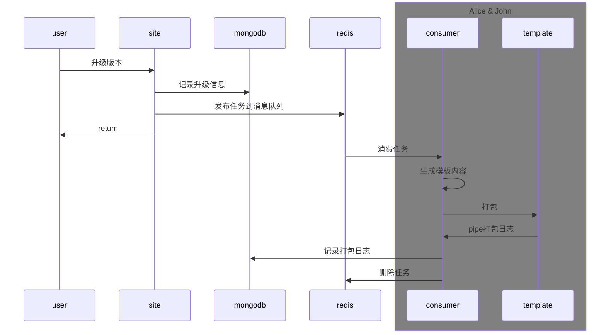

# icon-pack

***purpose***: 通过iconfont生成icon包，并进行版本管理。

- [X] 插件功能（iconfont）
  - [X] 现有图标迁移
  - [X] 增量合并
- [X] 组件库构建
  - [X] 组件库模板项目
  - [X] 队列消费和保障
  - [x] 构建日志
- [X] 版本管理
  - [X] 发包
  - [X] change log
- [X] 已发布包预览
- [X] 用户信息管理
- [X] 用户权限管理
- [X] 行为日志
  - [X] 新增，删除
  - [X] 更新
  - [X] 迁移
- [X] 动画图标支持

## consumer

负责消费队列，并通过template生成icon构建项目，调用template进行构建，并记录日志。

## plugin

负责第三方网站的迁移插件。

## schema

mongodb的数据结构，被site、consumer引用。

## site

负责插件和管理平台的接口、网页。

## template

根据consumer设置的环境变量，负责生成icon对应的包发布文件，并发布。

## utils

svg的公共处理方法。

> utils代码需要再浏览器环境、node环境都兼容。

# 使用

```sh
# 启动开发服务
docker compose -f ./docker/docker-compose.dev.yml up
```

```sh
# 部署生成环境
docker compose -f ./docker/docker-compose.prod.yml up
```

> 第一次启动需要构建镜像，时间较长，请耐心等待。

### 项目打包结构


