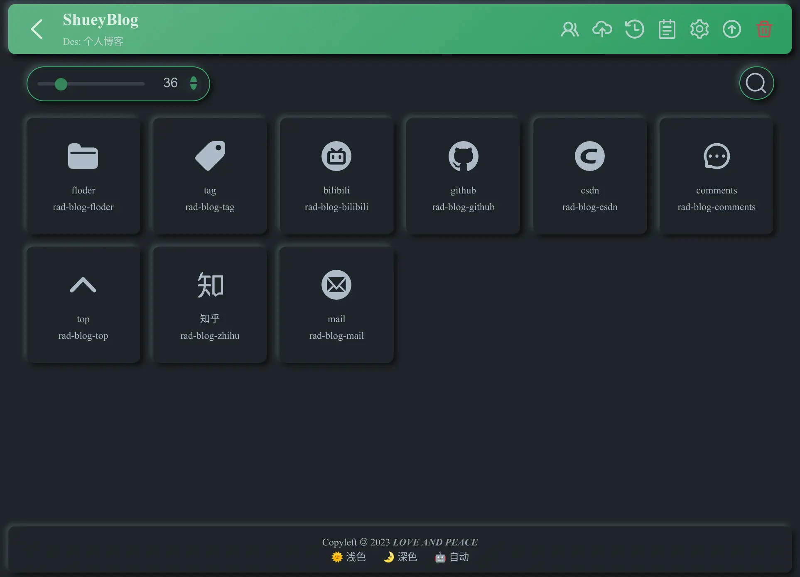
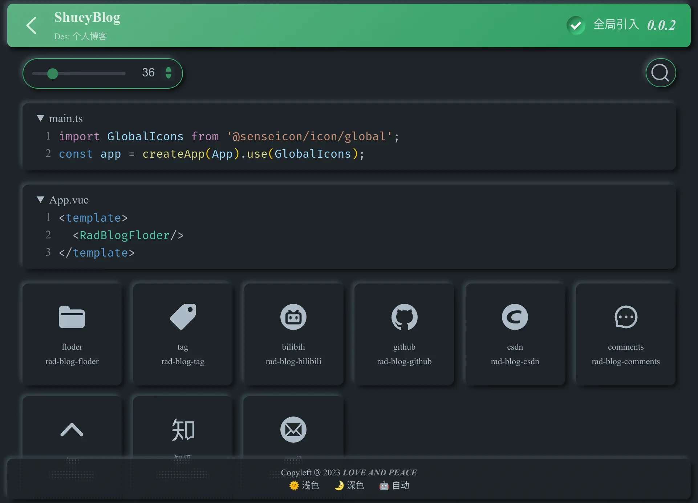
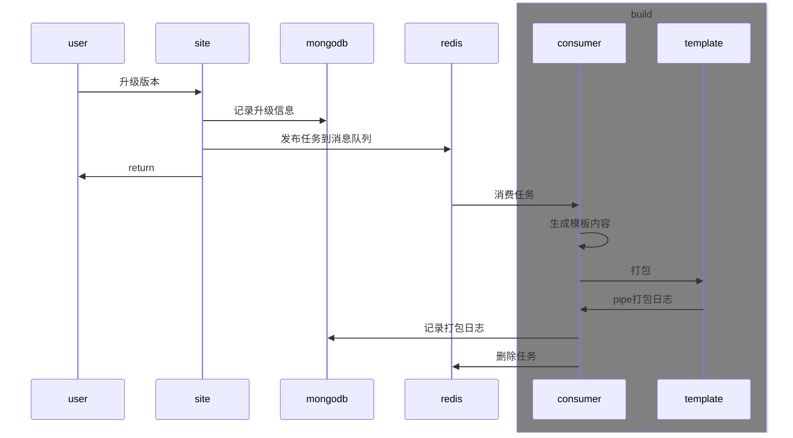

# icon-pack

***purpose***: Generate an icon pack using iconfont and manage versions.

### Screenshot





For detail usage: [docs](./docs/usage.md)

### Roadmap

- [X] Plugin Functionality (iconfont)
  - [X] Migration of existing icons
  - [X] Incremental merging
- [X] Component Library Build
  - [X] Component library template project
  - [X] Queue consumption and protection
  - [x] Building logs
- [X] Version Management
  - [X] Package deployment
  - [X] Change log
- [X] Preview of released packages
- [X] User information management
- [X] User permission management
- [X] Activity logs
  - [X] Additions, deletions
  - [X] Updates
  - [X] Migrations
- [X] Animation icon support

## consumer

Responsible for consuming the queue, generating an icon build project using templates, invoking the template for building, and logging the process.

## plugin

Responsible for the migration plugin for third-party websites.

## schema

Data structure for MongoDB, referenced by `site` and `consumer`.

## site

Responsible for the interface and web pages of the plugin and management platform.

## template

Based on the environment variables set by the consumer, responsible for generating package release files for icons and publishing them.

## utils

Shared methods for processing SVG images.

> Utils code needs to be compatible with both browser and Node.js environments.

# 使用

```sh
# start development services
docker compose -f ./docker/docker-compose.dev.yml up
```

```sh
# start production services
docker compose -f ./docker/docker-compose.prod.yml up
```

> Building the images for the first time takes a long time, please be patient.

### Project Structure


