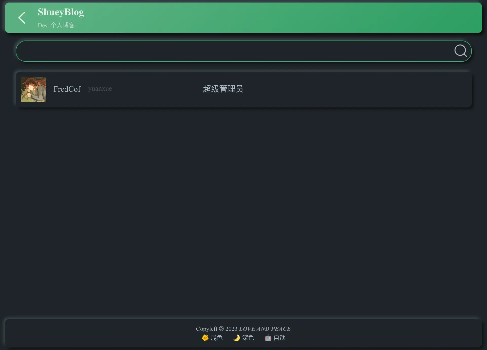

# Usage Docs

> Generated by [ChatGPT](https://chat.openai.com)

[TOC]

## 1. Introduction

Welcome to the Icon Management Website User Guide! This document provides instructions on how to use the various features and functionalities of our website for managing icons. Whether you are a project manager, designer, or developer, this guide will help you navigate through the different sections and perform tasks efficiently.

## 2. Getting Started

### 2.1 Registration and Login

To access the features of the icon management website, you need to register for an account. Follow these steps to create your account:

1. Visit the website homepage at [URL].
2. Click on the "Register" button.
3. Fill out the registration form with your details, including username, email, and password.
4. Submit the form and check your email for a verification link.
5. Click on the verification link to activate your account.
6. Return to the website and log in using your username and password.

### 2.2 Dashboard Overview

After logging in, you will be directed to your dashboard. The dashboard provides an overview of your projects, recently uploaded icons, and other relevant information. Take a moment to familiarize yourself with the layout and options available.

## 3. Project List

The project list page displays all the projects associated with your account. Use this section to manage your projects effectively.

### 3.1 Creating a New Project

To create a new project, follow these steps:

1. From the dashboard, click on the "Projects" tab.
2. Click on the "Create New Project" button.
3. Provide a unique name and optional description for your project.
4. Save the project details.

### 3.2 Viewing Project Details

To view the details of a specific project, follow these steps:

1. From the dashboard, click on the "Projects" tab.
2. Locate the desired project in the project list.
3. Click on the project name or associated options to view its details.

### 3.3 Modifying or Deleting a Project

To modify or delete a project, follow these steps:

1. From the dashboard, click on the "Projects" tab.
2. Locate the desired project in the project list.
3. Click on the project name or associated options to make modifications or delete the project.

## 4. Icon Details

The icon details page allows you to browse, search, and download icons from the website's collection.

### 4.1 Browsing Icons

To browse icons, follow these steps:

1. From the dashboard, click on the "Icons" tab.
2. Use the available filters and sorting options to narrow down the list of icons.
3. Scroll through the icons or use the pagination controls to navigate between pages.

### 4.2 Filtering and Sorting Icons

Use the filtering and sorting options to refine the displayed icons based on categories, tags, or other criteria. This will help you find the icons that meet your specific requirements.

### 4.3 Downloading an Icon

To download an icon, follow these steps:

1. Locate the desired icon from the list.
2. Click on the icon to view its details.
3. Click on the download button or link to initiate the download.

The downloaded icon will be saved to your device for further use.

## 5. User Management

User management allows you to control access and permissions for project members.

### 5.1 Adding Project Members

To add members to a project, follow these steps:

1. From the project details page, click on the "Members" or "User Management" section.
2. Click on the "Add Member" button.
3. Enter the email address or username of the person you want to add.
4. Set the appropriate permissions for the member (e.g., read-only, edit).
5. Click on the "Add" or "Save" button to add the member to the project.

### 5.2 Managing Project Members

To manage project members, follow these steps:

1. From the project details page, navigate to the "Members" or "User Management" section.
2. Locate the member you want to manage in the list.
3. Update their permissions or other details as needed.
4. Save the changes.

### 5.3 Removing Project Members

To remove a project member, follow these steps:

1. From the project details page, go to the "Members" or "User Management" section.
2. Locate the member you want to remove in the list.
3. Click on the remove or delete icon/button next to the member's name.
4. Confirm the removal when prompted.

## 6. Icon Upload

The icon upload feature allows you to contribute your own icons to the website.

### 6.1 Uploading an Icon

To upload an icon, follow these steps:

1. From the dashboard, click on the "Upload" or "Add Icon" button.
2. Select the icon file from your device's storage.
3. Wait for the upload process to complete.
4. Provide any required metadata or additional information about the icon (e.g., title, tags, categories).
5. Save the icon details.

### 6.2 Adding Metadata to an Icon

When uploading an icon, it is essential to provide accurate metadata to enhance searchability and categorization. Fill in relevant fields such as title, tags, and categories to describe the icon appropriately.

### 6.3 Updating or Deleting an Uploaded Icon

To update or delete an uploaded icon, follow these steps:

1. From the dashboard or icon details page, locate the desired icon.
2. Click on the icon to view its details.
3. Choose the appropriate action, such as updating metadata or deleting the icon.
4. Confirm any prompts for deletion or changes.

## 7. Icon Publishing

The icon publishing feature allows you to make your uploaded icons available for others to use.

### 7.1 Publishing an Icon

To publish icon package, follow these steps:

1. Log in to the Dashboard.
2. Access the Icon Project Details Page.
5. Upgrade the Icon Project.
4. Update the Version Number
5. Fill Out the Log
> Tip: Detailed upgrade logs help your users understand what's new in the update.
6. Publish the Upgrade

## 8. Check Build History

